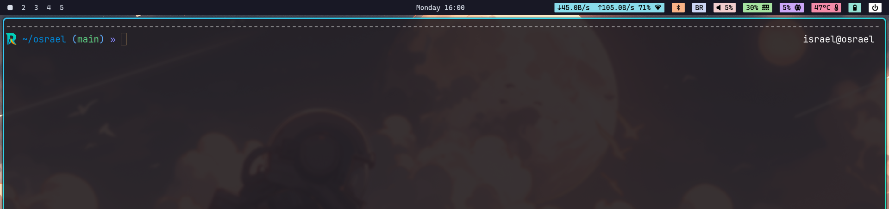

# Getting Started

### Why

This was inspired by the [omarchy](https://github.com/basecamp/omarchy) repo.
I loved the idea, but I felt that it installed many things I do not use.
I created my own version called **osRael**.

### Installation

To install make sure that you clone this repo in your **HOME** folder.
After that simply run `./install.sh` and follow any prompt that appear.

### Looks

I tried to pay attention to some colors and themes, here is how it looks currently.


Wallpapers can be found in `hyprland/wallpapers` and can be set by changing the **hyprpaper** config.

## Useful

### Hyprpaper

To reload the configuration run `systemctl --user restart hyprpaper`

### Arduino-IDE

Install with `yay -S arduino-ide`.

Connect the board and check `ls -l /dev/ttyUSB0`. It should show the group (e.g. `uucp`). Then do `sudo usermod -aG <group> $USER`.

### Formatting USB Drive

1. Check the mounting point of the USB drive with `lsblk`, lets assume `/dev/sdb`
1. Unmount the drive `sudo umount /dev/sdb*`
1. Wipe the old signatures and make a GPT partition

```bash

sudo wipefs -a /dev/sdb
sudo parted -s /dev/sdb mklabel gpt
sudo parted -s /dev/sdb mkpart primary 1MiB 100%

```

To make a **FAT32** install `dosfstools` and run `sudo mkfs.vfat -F 32 -n LABEL /dev/sdb1`

To make a **exFAT** install `exfatprogs` and run `sudo mkfs.exfat -n LABEL /dev/sdb1`

### Burning ISO

Run:

```bash

sudo dd if=<iso-path> of=<usb-path> bs=4M status=progress conv=fsync

```

Usually `usb-path=/dev/sdb`

### Avoid turning off when closing lid

```bash

systemd-inhibit --what=handle-lid-switch sleep 1d`

```

You can change the value for sleep, e.g. 2d, 7d, etc..

### Saving images from clipboard

Check the current type in the clipboard with `wl-paste --list-types`.

Save an image from the clipboard with `wl-paste --type image/png > path.png`. Adjust the file format accordingly from the previous command.
